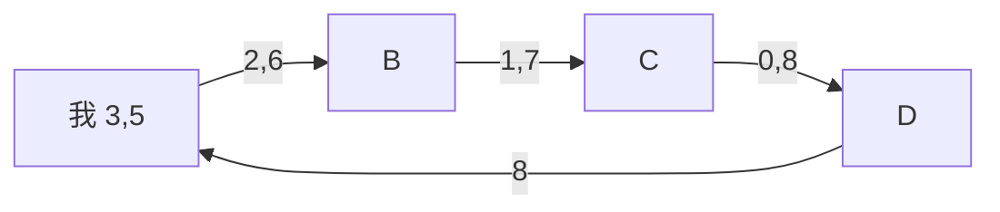
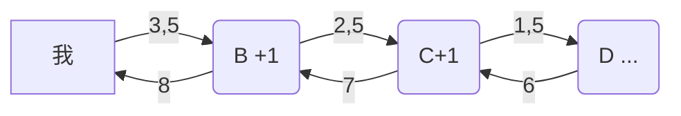

递归和迭代是很重要的编程思想，所以对于其原理还是很有必要清楚的。

**迭代(iteration)**   在 [**维基百科**](https://en.wikipedia.org/wiki/Iteration) 上是这样介绍的：

> Iteration is the repetition of a process in order to generate a (possibly unbounded) sequence of outcomes. The sequence will approach some end point or end value. Each repetition of the process is a single iteration, and the outcome of each iteration is then the starting point of the next iteration.
>
>
> 迭代是重复反馈过程的活动，其目的通常是为了接近并到达所需的目标或结果。每一次对过程的重复被称为一次“迭代”，而每一次迭代得到的结果会被用来作为下一次迭代的初始值。

上面介绍可以说是非常细致详尽了，这里还是来个小例子具体说明下我对迭代的理解吧～
##### 分析过程
目的： 接近并达到所需的 **目标或结果**
过程：重复反馈每一次 **过程**
文字描述：可以这么想，我左手一袋小球(3个)，右手一袋小球（5个），我想知道这两袋里面一共有几个小球，可是我不会加法运算啊（我朋友们也不会），咋办呢，把它给我朋友折腾吧，折腾完给我个结果。
于是我把它交给朋友A，朋友A把左手袋子里的小球拿出一个放到了右手袋子里，告诉朋友B：我左手这袋子有两个小球，右手这袋子里有6个小球，又给了朋友B，朋友B照做又给了朋友C......

##### 图示如下：

即：
3 + 5 &nbsp; |
2 + 6 &nbsp;   | 
1 + 7 &nbsp; |
0 + 8 &nbsp; |
8 &nbsp;&nbsp;&nbsp;&nbsp;&nbsp; &nbsp;  |
————
时间复杂度为 O(x)
空间复杂度为O(1)

---
**递归（Recursion）** 在 [**维基百科**](https://en.wikipedia.org/wiki/Recursion) 上是这样介绍的：
> Recursion occurs when a thing is defined in terms of itself or of its type. Recursion is used in a variety of disciplines ranging from linguistics to logic. The most common application of recursion is in mathematics and computer science, where a function being defined is applied within its own definition. While this apparently defines an infinite number of instances (function values), it is often done in such a way that no loop or infinite chain of references can occur.
> 递归（英语：Recursion），又译为递回，在数学与计算机科学中，是指在函数的定义中使用函数自身的方法。递归一词还较常用于描述以自相似方法重复事物的过程。例如，当两面镜子相互之间近似平行时，镜中嵌套的图像是以无限递归的形式出现的。也可以理解为自我复制的过程。

**通俗点说**，递归就是那个脍炙人口的故事：从前有座山，山里有座庙，庙里有个老和尚，正在给小和尚讲故事呢！故事是什么呢？“从前有座山，山里有座庙，庙里有个老和尚，正在给小和尚讲故事呢！故事是什么呢？‘从前有座山，山里有座庙，庙里有个老和尚，正在给小和尚讲故事呢！故事是什么呢？……’”
典型案例：[斐波那契数列](https://zh.wikipedia.org/wiki/%E6%96%90%E6%B3%A2%E9%82%A3%E5%A5%91%E6%95%B0%E5%88%97)
还是上面分小球的例子，递归就是在过程中得到的结果，还要将结果返回给自身，然后继续传下去...小伙伴们一起忙起来～啦啦啦～

#### 图示如下：

即：
3 + 5&nbsp; |
1 + 2 + 5&nbsp; |
1 + 1 + 1 + 5&nbsp; |
1 + 1 + 1 + 0 +5&nbsp; |
1 + 1 + 1 + 5&nbsp; |
1 + 1 + 6&nbsp; |
1 + 7&nbsp; |
8&nbsp; |
时间复杂度为 O(x)
空间复杂度为O(x)

若发生事物故障，迭代过程中的数据已经保存在了程序中了，而递归会有一些不可见的过程在暗暗发生...（蹊跷地那种呦～/逃